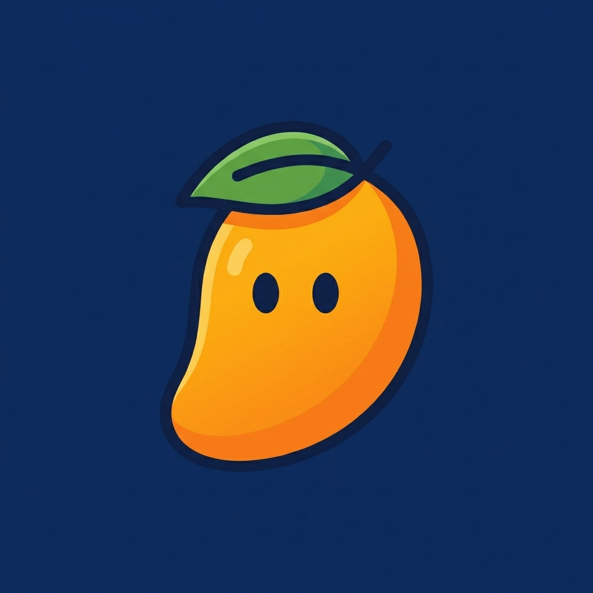
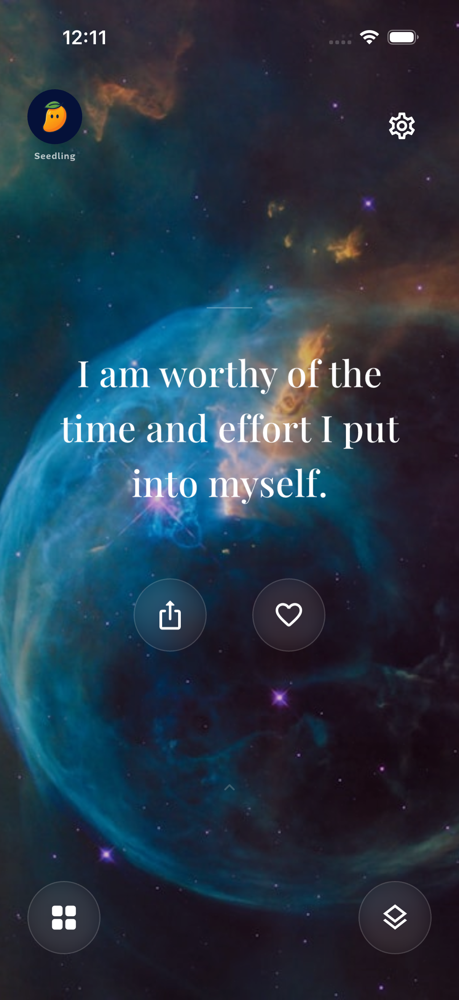
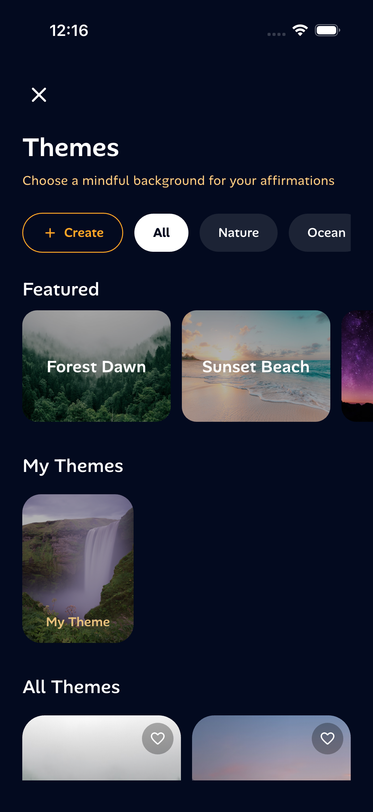
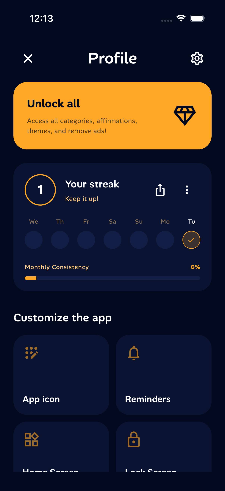
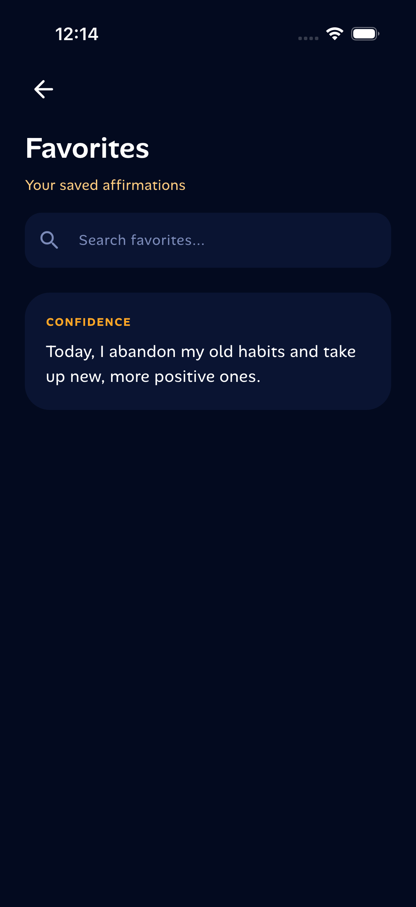
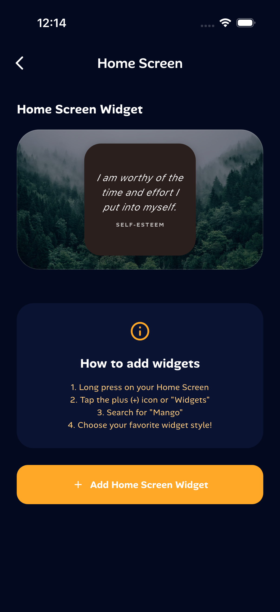

<p align="center">
  
</p>

<h1 align="center">🥭 Mango</h1>

<p align="center">
  <strong>A beautiful self-affirmation app with immersive themes, daily streaks, and iOS widgets.</strong>
</p>

<p align="center">
  
  
  
  
</p>

---

## ✨ Features

- **Daily Affirmations** — Swipe through curated affirmations with parallax backgrounds
- **Custom Themes** — Choose from nature, ocean, and cosmic backgrounds or create your own
- **Focus Categories** — Self-Love, Confidence, Gratitude, Success, Health & more
- **Favorites** — Save and search your favorite affirmations
- **Streak Tracking** — Build daily consistency with visual streak tracking
- **iOS Home & Lock Screen Widgets** — Affirmations on your home screen
- **Mango Mascot** — Evolving mascot that grows with your streak
- **Share** — Share beautifully styled affirmation cards
- **Dark Theme** — Deep navy & mango accent color palette throughout

---

## 📱 Screenshots

<p align="center">
  
  &nbsp;&nbsp;
  
  &nbsp;&nbsp;
  
</p>

<p align="center">
  
  &nbsp;&nbsp;
  
  &nbsp;&nbsp;
  
</p>

---

## 🏗️ Architecture

```
lib/
├── core/
│   ├── constants/       # App-wide constants
│   ├── di/              # Dependency injection (GetIt)
│   ├── routes/          # Route definitions (GetX)
│   ├── theme/           # App colors, typography, theme config
│   ├── utils/           # Haptic feedback utilities
│   └── widgets/         # Shared widgets
├── features/
│   ├── home/            # Affirmation display with parallax
│   ├── focus/           # Focus mode & breathing
│   ├── favorites/       # Saved affirmations
│   ├── themes/          # Theme gallery & custom creation
│   ├── settings/        # Profile, streaks, customization
│   ├── onboarding/      # First-launch onboarding
│   └── splash/          # Splash screen
├── models/              # Affirmation, Theme, Category, Preferences
├── repository/          # Data access layer
├── services/            # Mascot, Streak, Widget services
└── widgets/             # Global reusable widgets
```

---

## 🛠 Tech Stack

| Layer              | Technology                                |
|--------------------|-------------------------------------------|
| Framework          | Flutter 3.7 / Dart 3.7                    |
| State Management   | GetX                                      |
| DI                 | GetIt                                     |
| Local Storage      | Hive + SharedPreferences                  |
| Notifications      | flutter_local_notifications               |
| Widgets            | home_widget (iOS/Android)                 |
| Animations         | flutter_animate                           |
| Typography         | Custom AlanSans font family               |
| Images             | cached_network_image, image_picker        |

---

## 🚀 Getting Started

### Prerequisites

- Flutter SDK `^3.7.2`
- Xcode (for iOS) / Android Studio (for Android)

### Installation

```bash
# Clone the repository
git clone https://github.com/ibhanu/mango.git
cd mango

# Install dependencies
flutter pub get

# Run the app
flutter run
```

### Build

```bash
# iOS
flutter build ios

# Android
flutter build apk
```

---

## 🎨 Design System

The app uses a cohesive dark design system:

- **Background**: Deep navy `#030A1F`
- **Surface**: Dark blue `#0A1432`
- **Accent**: Mango orange `#FFA726`
- **Typography**: Custom *AlanSans* font family (400–700 weights)
- **Corner Radius**: 16px buttons, 24px cards
- **Material 3** with dark color scheme

---

## 📄 License

This project is licensed under the MIT License.

---

<p align="center">
  Made with 🥭 by <a href="https://github.com/ibhanu">ibhanu</a>
</p>
